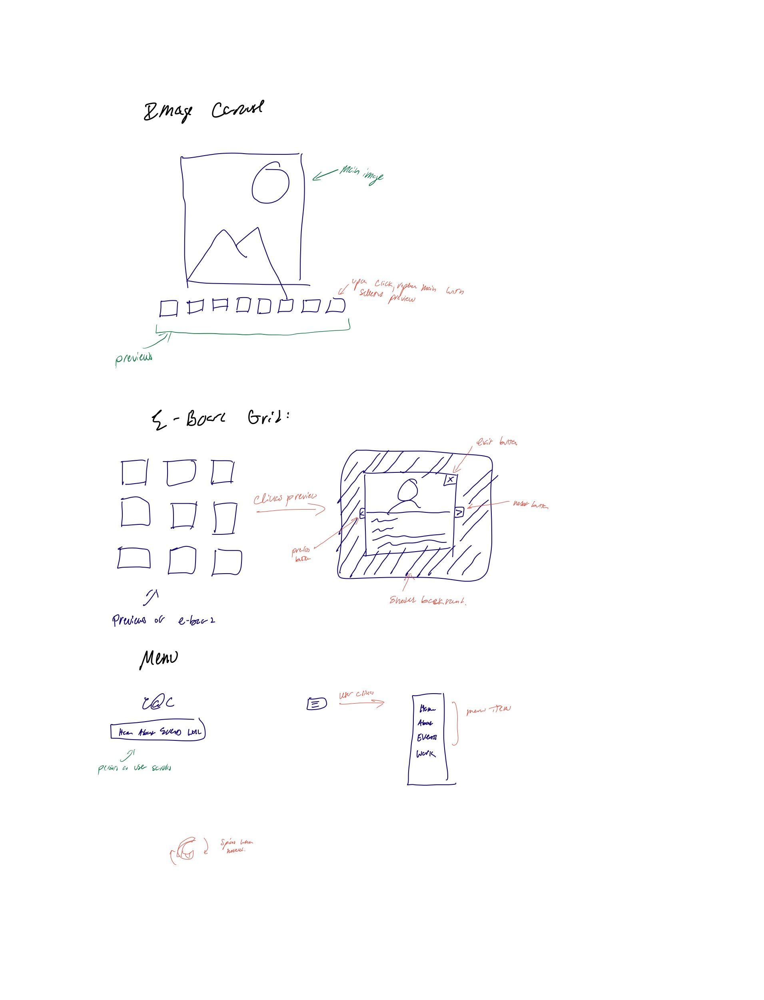
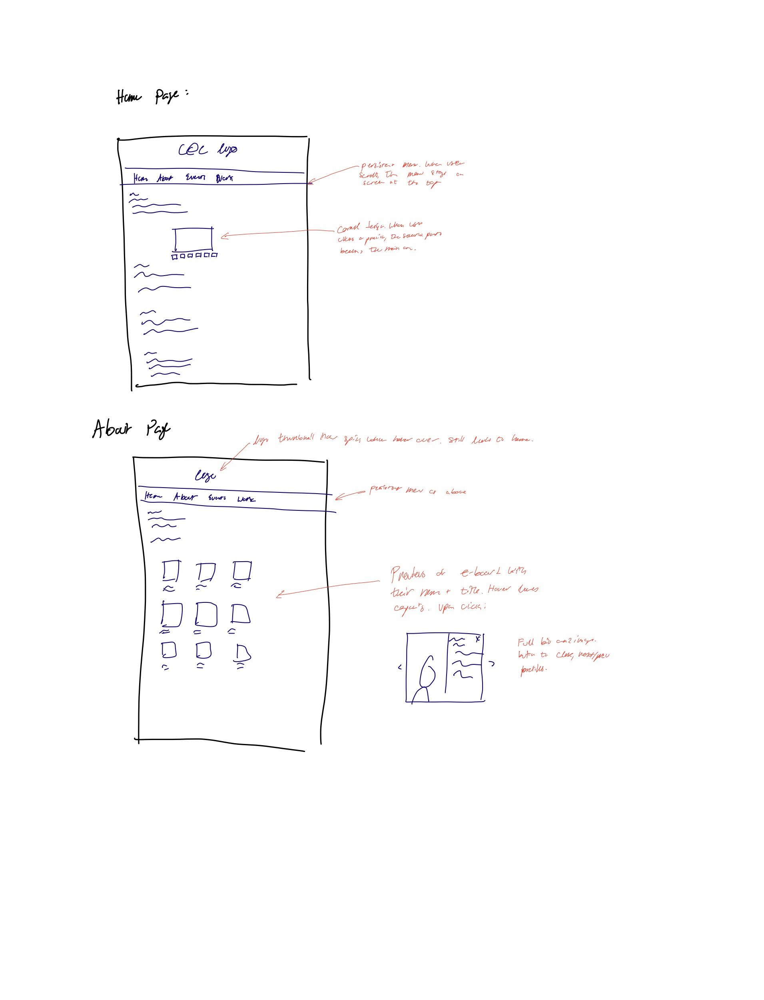
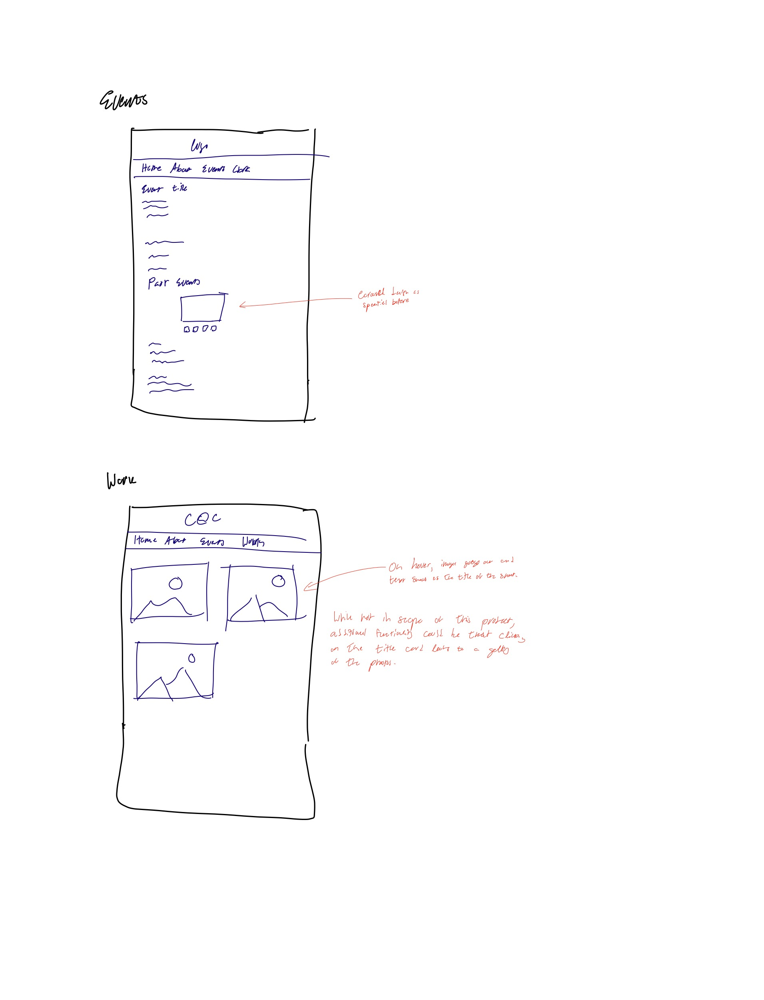
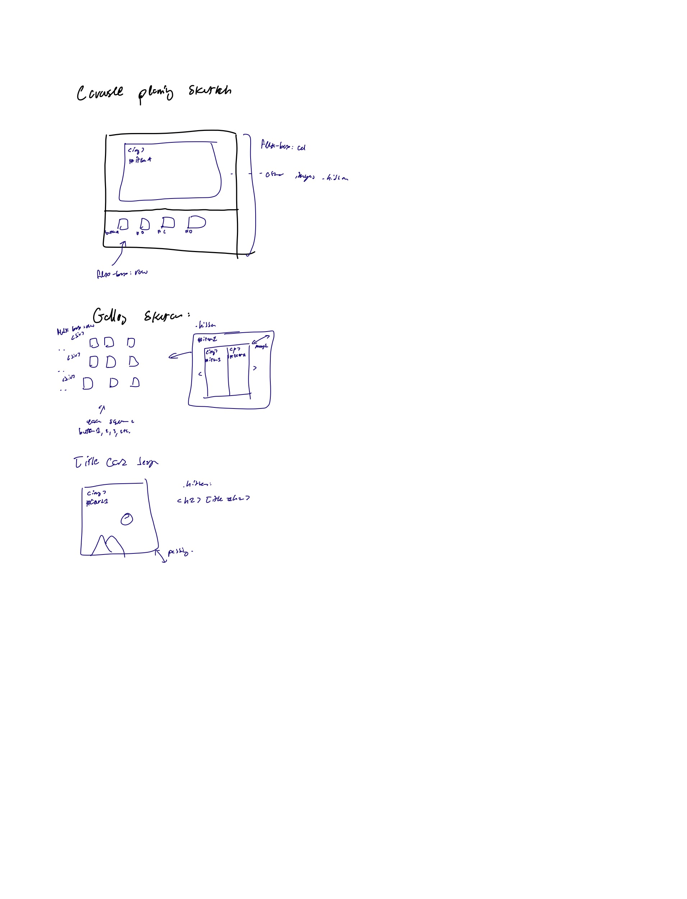

# Project 3: Design Journey

**For each milestone, complete only the sections that are labeled with that milestone.** Refine all sections before the final submission.

You are graded on your design process. If you later need to update your plan, **please do not delete the original plan, leave it in place and append your new plan _below_ the original.** Then explain why you are changing your plan. Any time you update your plan, you're documenting your design process!

**Replace ALL _TODOs_ with your work.** (There should be no TODOs in the final submission.)

Be clear and concise in your writing. Bullets points are encouraged.

**Everything, including images, must be visible in _Markdown: Open Preview_.** If it's not visible in the Markdown preview, then we can't grade it. We also can't give you partial credit either. **Please make sure your design journey should is easy to read for the grader;** in Markdown preview the question _and_ answer should have a blank line between them.

## Existing Project (Milestone 1)

**Tell us about the project you'll be using for Project 3.**

### Project (Milestone 1)
> Which project will you add interactivity to enhance the site's functionality?

Project 1

### Audience (Milestone 1)
> Briefly explain your site's audience.
> Be specific and justify why this audience is a **cohesive** group.

The audience of this site are students of Cornell and those interested in learning more about the club. This tends to be photographers and videographers, as well as members and individuals of other clubs or organizations looking to collab with our club. Site visitors likely want to learn more about the club and understand what the club has to offer. This is a cohesive group because they all have a common interest in photography and videography, and are looking to learn more about the club, and are a subset of Cornell.

### Audience's Goals (Milestone 1)
> List the audience's goals that you identified in Project 1 or 2.
> Simply list each goal. No need to include the "Design Ideas and Choices", etc.
> You may adjust the goals if necessary.

Goal 1: To learn more about Capture at Cornell - it's past and present offerings, what they do, if they want to join.

Goal 2: To join the club by filling out the quick form, or to contact the e-board.

Goal 3: To collab with the club by filling out the form.

## Interactivity Design (Milestone 1)

### Interactivity Brainstorm (Milestone 1)
> Using the audience goals you identified, brainstorm possible options for interactivity to enhance the functionality of the site while also assisting the audience with their goals.
> Briefly explain each idea and provide a brief rationale for how the interactivity enhances the site's functionality for the audience.
> Note: You may find it easier to sketch for brainstorming. That's fine too. Do whatever you need to do to explore your ideas.

- A carousel of photos showing off the club g-bodys
- E-board grid which shows all the images, and clicking an individual expands their bio.
- An e-board carousel that works in a similar way to the grid
- A hamburger menu that slides away or persists.
- A purely decorational camera that flashes when clicked.
- The C@C logo spins when hovered.
- Dark mode!

### Interactivity Design Ideation (Milestone 1)
> Explore the possible design solutions for the interactivity.
> Sketch several iterations of your interactivity.
> Annotate each sketch explaining what happens when a user takes an action. (e.g. When user clicks this, something else appears.)

### Final Interactivity Design (Milestone 1)
> Create _polished_ sketch(es) (it's still a sketch, but with a little more care taken to communicate ideas clearly to the graders) to plan your interactivity.
> **Sketch out the entire page where your interactivity will go.**
> Include your interactivity to the sketch(es).
> Add annotations to explain what happens when the user takes an action.
> Include as many sketches as necessary to communicate your design (ask yourself, could another 1300 take these sketches an implement my design?)

### Interactivity Rationale (Milestone 1)
> Describe the purpose of your proposed interactivity.
> Provide a brief rationale explaining how your proposed interactivity addresses the goals of your site's audience.
> This should be about a paragraph. (3-5 sentences)

This website is primarily a media-oriented website. Therefore, the interactive features are those that are targeted to showing off media in a aesthetic and functional way. Therefore, I choose to use features such as a carousel and gallery view for the purposes of displaying photos. Other features an improved menu bar, and some cosmetic additions purely for style.

## Interactivity Implementation Plan (Milestone 1)

### Interactivity Planning Sketches (Milestone 1)

### Interactivity Pseudocode Plan (Milestone 1)
> Write your interactivity pseudocode plan here.
> Pseudocode is not JavaScript. Please do not put JavaScript code here.

**Carousel:**
On load, itemA is only element without .hidden
When button a is clicked:
- add .hidden to current item
- remove .hidden to itemA

Every 5 seconds, display next item by adding .hidden to the current item and removing .hidden to the next item.

On hover, a button will lower its opacity and change the cursor to infer feedback.

**Gallery**
On load, the grid of buttons as thumbnails will appear.
When button a is clicked, for example:
- remove .hidden from itemA

When the exit button on itemA is clicked,
- add .hidden back to itemA

When the next/prev arrow is clicked,
- add .hidden to the current item showing
- remove .hidden to the next/prev item

**Logo Spin**
When mouse hovers over the logo
- Rotate the logo with a exponential "s" acceleration

**Image Cards**
When mouse hovers over a card
- remove .hidden from textA
- set opacity to around 70% for clarity

### "Ambitious" Interactivity Explanation (Milestone 1)
> In your own words, concisely explain why you believe your interactivity meets the "ambitious" requirement.
> This should be a few sentences. (1-3 sentences)

The design is ambitious because it will attempt to implement a number of interactive features that will enhance the user experience. The carousel, for example, auto advances every few seconds, and the gallery with preview, have the ability to go to the previous or next element. Most importantly, I made the card feature for the e-board. There is significant coding required in HTML, CSS, and JS, and I believe that this will be a challenge to implement, similar to that of the examples provided. However, it will add an element of aesthetic and functionality to the website.

## Grading (Final Submission)

### Interactivity Usability Justification (Final Submission)
> Explain how your design effectively uses affordances, visibility, feedback, and familiarity.
> Write a large paragraph (4-6 sentences)

Affordances: when the user hovers their mouse over an interactive element, the element lowers capacity and the cursor indicates the ability to click. The outline of the thumbnail indicates the selected image, and the auto-advance suggests the ability to change the image.
Visiblity: For the gallery, the three available thumbnails are available to cycle through. For the e-board cards, the full bio is hidden until the card is clicked, for brevity and because the bio need not immediately be visible.
Feedback: When an item is clicked, the gallery image changes to it. For the cards, they "flip" and the bio is revealed.
Familiarity: The gallery is certainly a familiar pattern that most users will have no trouble working with. The cards for the e-board may be newer for some, but the affordances and ease of interaction will help them to learn it quickly.

### Tell Us What to Grade (Final Submission)
> We aren't re-grading your Project 1 or 2.
> We are only grading the interactivity you added.
> Tell us where (what pages) we can find your interactivity and how to use it.
> **We will only grade what you list here;** if it's not listed, we won't grade it.

Please grade the image gallery on the home page, and the card gallery of the e-board on the about page.

### Collaborators (Final Submission)
> List any persons you collaborated with on this project.

None.

### Reference Resources (Final Submission)
> Please cite any external resources you referenced in the creation of your project.
> (i.e. W3Schools, StackOverflow, Mozilla, etc.)

StackOverflow, Mozilla Dev Reference.

### Self-Reflection (Final Submission)
> This was the first project in this class where you coded some JavaScript. What did you learn from this experience?

I found JS to be largely straightforward and similar to programming I've done in Java (no surprise there). I found code repetition to be annoying and tedious, and would like to learn how to reduce repetition. For example, on the lab, I reduced the originally 30+ lines of code to just one function and four function calls. I would have liked to do the same here, but couldn't sus it out. I wanted a working website, even if there's ugly work under the hood.

> Take some time here to reflect on how much you've learned since you started this class. It's often easy to ignore our own progress. Take a moment and think about your accomplishments in this class. Hopefully you'll recognize that you've accomplished a lot and that you should be very proud of those accomplishments!

After some experimenting, I've not only learned to create website, but create them so they are visually pleasing and aesthetic. Though these ideas weren't taught in class, it was fun to explore different design choices - I ultimately went with the "card" design language (which is entirely for styling, not content, but enhances the experience nonetheless).
